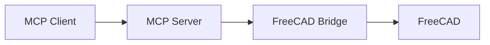

# MkDocs Documentation Guide

This project uses [MkDocs](https://www.mkdocs.org/) with the [Material theme](https://squidfunk.github.io/mkdocs-material/) for documentation. This guide covers our specific configuration, extensions, and how to use them.

## Quick Start

```bash
# Serve docs locally with live reload
just documentation::serve

# Build static site
just documentation::build

# Open docs in browser
just documentation::open
```

## Theme Configuration

We use **Material for MkDocs** with dark mode as the default. Users can toggle between dark and light modes using the sun/moon icon in the header.

**Color scheme:** Deep purple primary with purple accent.

## Markdown Extensions

### Code Blocks

#### Syntax Highlighting

Standard fenced code blocks with language hints:

````markdown
```python
def hello():
    print("Hello, world!")
```
````

#### Line Numbers and Highlighting

````markdown
```python linenums="1" hl_lines="2 3"
def hello():
    # These lines are highlighted
    print("Hello!")
```
````

#### Code Annotations

Add numbered annotations that expand on hover:

````markdown
```python
def process(data):  # (1)!
    return data.strip()  # (2)!
```

1. This function processes input data
2. Removes leading/trailing whitespace

````

#### Inline Code Highlighting

Use `#!python print("inline")` for inline syntax highlighting:

```markdown
Use `#!python print("inline")` for inline code with highlighting.
```

---

### Tabbed Content

Create tabs for platform-specific or alternative content:

```markdown
=== "macOS"

    ```bash
    ~/Library/Application Support/FreeCAD/Macro/
    ```

=== "Linux"

    ```bash
    ~/.local/share/FreeCAD/Macro/
    ```

=== "Windows"

    ```bash
    %APPDATA%/FreeCAD/Macro/
    ```
```

**Renders as:**

<!-- markdownlint-disable MD046 -->
=== "macOS"

    ```bash
    ~/Library/Application Support/FreeCAD/Macro/
    ```

=== "Linux"

    ```bash
    ~/.local/share/FreeCAD/Macro/
    ```

=== "Windows"

    ```bash
    %APPDATA%/FreeCAD/Macro/
    ```
<!-- markdownlint-enable MD046 -->

---

### Admonitions (Call-outs)

Create styled call-out boxes:

```markdown
!!! note "Optional Title"
    This is a note admonition.

!!! warning
    This is a warning without a custom title.

!!! danger "Critical"
    This is a danger/error admonition.

!!! tip
    This is a tip admonition.

!!! info
    This is an info admonition.

!!! example
    This is an example admonition.
```

**Collapsible admonitions:**

```markdown
??? note "Click to expand"
    This content is hidden by default.

???+ note "Expanded by default"
    This content is visible but can be collapsed.
```

**Available types:** `note`, `abstract`, `info`, `tip`, `success`, `question`, `warning`, `failure`, `danger`, `bug`, `example`, `quote`

---

### Task Lists

Create checkbox lists:

```markdown
- [x] Completed task
- [ ] Incomplete task
- [ ] Another task
```

**Renders as:**

- [x] Completed task
- [ ] Incomplete task
- [ ] Another task

---

### Keyboard Keys

Style keyboard shortcuts:

```markdown
Press ++ctrl+c++ to copy.
Press ++cmd+shift+p++ on macOS.
Press ++enter++ to confirm.
```

**Renders as:** Press ++ctrl+c++ to copy.

**Common keys:** `ctrl`, `alt`, `shift`, `cmd`, `enter`, `tab`, `esc`, `backspace`, `delete`, `up`, `down`, `left`, `right`, `f1`-`f12`

---

### Text Formatting

#### Highlighting

```markdown
==This text is highlighted==
```

**Renders as:** ==This text is highlighted==

#### Subscript and Superscript

```markdown
H~2~O (subscript)
x^2^ (superscript)
```

**Renders as:** H~2~O and x^2^

#### Strikethrough

```markdown
~~deleted text~~
```

**Renders as:** ~~deleted text~~

#### Critic Markup (for diffs/reviews)

```markdown
{--deleted--}
{++added++}
{~~old~>new~~}
{==highlighted==}
{>>comment<<}
```

---

### Definition Lists

```markdown
Term 1
:   Definition for term 1

Term 2
:   Definition for term 2
:   Can have multiple definitions
```

**Renders as:**

Term 1
:   Definition for term 1

Term 2
:   Definition for term 2
:   Can have multiple definitions

---

### Footnotes

```markdown
This needs a citation[^1].

[^1]: This is the footnote content.
```

---

### Mermaid Diagrams

Create diagrams using Mermaid syntax:

````markdown

````

**Renders as:**


**Supported diagram types:** flowchart, sequence, class, state, ER, gantt, pie, journey

---

## Plugins

### Git Revision Date

Pages automatically show "Last updated X ago" at the bottom. No action needed.

### Image Lightbox (GLightbox)

All images are automatically zoomable. Click any image to open in a lightbox overlay.

To exclude an image from lightbox:

```markdown
{ .off-glb }
```

### Minification

HTML is automatically minified in production builds. No action needed.

### Search

Full-text search is enabled. Features:

- Search suggestions as you type
- Search result highlighting
- Shareable search URLs

---

## Macros Plugin

### Custom Delimiters

<!-- markdownlint-disable MD046 -->
!!! warning "Important"
    We use **custom delimiters** to avoid conflicts with Python dict literals in code blocks.

    - Variables: `{` `{@` and `@}` `}`
    - Blocks: ``

    Standard Jinja2 `{` `{` `}` `}` syntax will NOT work.
<!-- markdownlint-enable MD046 -->

### Using Variables

Variables are defined in `docs/variables.yaml`:

```yaml
# docs/variables.yaml
project_name: FreeCAD MCP Server
package_name: freecad-robust-mcp
xmlrpc_port: 9875
socket_port: 9876
```

Use in Markdown:

```markdown
The default XML-RPC port is {{@ xmlrpc_port @}}.
Install with: `pip install {{@ package_name @}}`
```

### Available Variables

| Variable | Value | Description |
|----------|-------|-------------|
| `project_name` | FreeCAD MCP Server | Display name |
| `package_name` | freecad-robust-mcp | PyPI package name |
| `docker_image` | spkane/freecad-robust-mcp | Docker image |
| `xmlrpc_port` | 9875 | XML-RPC server port |
| `socket_port` | 9876 | Socket server port |
| `paths.macos.macro` | ~/Library/... | macOS macro path |
| `paths.linux.macro` | ~/.local/share/... | Linux macro path |
| `paths.windows.macro` | %APPDATA%/... | Windows macro path |

### Built-in Macros

```markdown
Current time: {{@ now() @}}
Page URL: {{@ page.url @}}
```

---

## API Documentation (mkdocstrings)

Auto-generate API docs from Python docstrings:

```markdown
::: freecad_mcp.server
    options:
      show_source: true
      heading_level: 3
```

This renders the module's docstrings, classes, and functions automatically.

**Options:**

- `show_source: true` - Show source code
- `heading_level: 3` - Start headings at h3
- `members: [func1, func2]` - Only show specific members
- `filters: ["!^_"]` - Exclude private members

---

## Navigation

### Features Enabled

- **Instant navigation** - Pages load without full refresh
- **Navigation tabs** - Top-level sections as tabs
- **Section index pages** - Click section to see overview
- **Back to top** - Button appears when scrolling
- **Table of contents** - Follows scroll position

---

## Images

### Basic Image

```markdown

```

### Image with Caption

```markdown
<figure markdown>
  
  <figcaption>This is the caption</figcaption>
</figure>
```

### Image Alignment

```markdown
{ align=left }
{ align=right }
```

### Image Size

```markdown
{ width="300" }
```

---

## Links

### Internal Links

```markdown
[Installation Guide](../getting-started/installation.md)
[Config section](configuration.md#environment-variables)
```

### External Links

External links automatically open in new tab (Material theme default).

```markdown
[FreeCAD](https://www.freecad.org/)
```

---

## Tables

Standard Markdown tables with sorting enabled:

```markdown
| Column 1 | Column 2 | Column 3 |
|----------|----------|----------|
| Data 1   | Data 2   | Data 3   |
| Data 4   | Data 5   | Data 6   |
```

---

## File Structure

```text
docs/
├── index.md                 # Home page
├── variables.yaml           # Macros variables
├── overrides/               # Theme customizations
│   └── .gitkeep
├── assets/                  # Images, favicon, etc.
├── getting-started/
│   ├── installation.md
│   ├── configuration.md
│   └── quickstart.md
├── guide/
│   └── ...
├── api/
│   └── ...
└── development/
    ├── contributing.md
    ├── architecture.md
    ├── releasing.md
    └── mkdocs-guide.md      # This file
```

---

## Common Tasks

### Adding a New Page

1. Create the markdown file in the appropriate directory
2. Add to `nav:` section in `mkdocs.yaml`

### Adding Redirects

If you move/rename a page, add a redirect in `mkdocs.yaml`:

```yaml
plugins:
  - redirects:
      redirect_maps:
        'old-page.md': 'new-location/new-page.md'
```

### Custom CSS

Add custom styles in `docs/overrides/stylesheets/extra.css` and reference in `mkdocs.yaml`:

```yaml
extra_css:
  - overrides/stylesheets/extra.css
```

### Custom JavaScript

Add scripts in `docs/overrides/javascripts/extra.js` and reference in `mkdocs.yaml`:

```yaml
extra_javascript:
  - overrides/javascripts/extra.js
```

---

## Troubleshooting

### Macros Not Rendering

Remember to use custom delimiters: `{{@ variable @}}` not `{{ variable }}`.

### Git Revision Date Warnings

New files not yet committed will show warnings. Commit the file to fix.

### Build Errors

```bash
# Check for syntax errors
uv run mkdocs build --strict

# Verbose output
uv run mkdocs build -v
```

### Serve Not Auto-Reloading

Some changes (like `mkdocs.yaml`) require restarting the server.

---

## Reference Links

- [MkDocs Documentation](https://www.mkdocs.org/)
- [Material for MkDocs](https://squidfunk.github.io/mkdocs-material/)
- [PyMdown Extensions](https://facelessuser.github.io/pymdown-extensions/)
- [mkdocstrings](https://mkdocstrings.github.io/)
- [mkdocs-macros-plugin](https://mkdocs-macros-plugin.readthedocs.io/)
