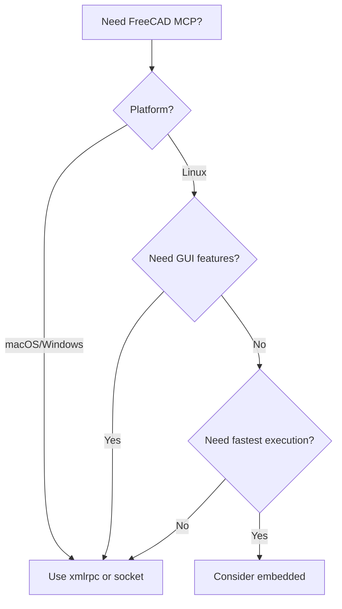

# Connection Modes

The FreeCAD Robust MCP Server supports multiple ways to connect to FreeCAD. Choose the mode that best fits your workflow.

---

## Overview

| Mode       | Description                       | Platform      | Best For                         |
| ---------- | --------------------------------- | ------------- | -------------------------------- |
| `xmlrpc`   | XML-RPC protocol (port 9875)      | All platforms | Production use (recommended)     |
| `socket`   | JSON-RPC over TCP sockets         | All platforms | Alternative to XML-RPC           |
| `embedded` | FreeCAD imported into MCP process | Linux only    | Fastest execution, CI/automation |

---

## XML-RPC Mode (Recommended)

XML-RPC mode is the **default and recommended** connection method. It works on all platforms and provides robust, reliable communication.

### How It Works

```text
MCP Client <--stdio--> Robust MCP Server <--XML-RPC:9875--> FreeCAD
```

The Robust MCP Server communicates with FreeCAD via XML-RPC protocol on port 9875.

### Setup

1. Start FreeCAD with the Robust MCP Bridge workbench
1. Click **Start Bridge** (or it auto-starts if configured)
1. Configure the Robust MCP Server:

```bash
export FREECAD_MODE=xmlrpc
export FREECAD_XMLRPC_PORT=9875  # default
freecad-mcp
```

### Advantages

- Works on all platforms (macOS, Linux, Windows)
- Process isolation (FreeCAD crash doesn't affect Robust MCP Server)
- Supports both GUI and headless FreeCAD

---

## Socket Mode

Socket mode uses JSON-RPC over TCP sockets instead of XML-RPC.

### How It Works

```text
MCP Client <--stdio--> Robust MCP Server <--JSON-RPC:9876--> FreeCAD
```

### Setup

```bash
export FREECAD_MODE=socket
export FREECAD_SOCKET_HOST=localhost
export FREECAD_SOCKET_PORT=9876
freecad-mcp
```

### Advantages

- JSON-based protocol (easier to debug)
- Lower overhead than XML-RPC
- Works on all platforms

---

## Embedded Mode (Linux Only)

!!! danger "Platform Limitation"
Embedded mode **only works on Linux**. On macOS and Windows, it causes crashes due to Python ABI incompatibility.

Embedded mode imports FreeCAD directly into the Robust MCP Server process, providing the fastest execution.

### Why It Crashes on macOS/Windows

FreeCAD's `FreeCAD.so` library links to `@rpath/libpython3.11.dylib` (FreeCAD's bundled Python). When you try to import it from a different Python interpreter (even the same version), it causes a crash because the Python runtime state is incompatible.

### Setup (Linux Only)

```bash
export FREECAD_MODE=embedded
export FREECAD_PATH=/usr/lib/freecad/lib  # Adjust for your system
freecad-mcp
```

### Advantages

- Fastest execution (no IPC overhead)
- No need to start FreeCAD separately
- Works in CI/CD environments on Linux

### Limitations

- **Linux only** - crashes on macOS and Windows
- Headless only (no GUI features)
- **Minimal testing** - embedded mode receives less testing than xmlrpc/socket modes
- Cannot access FreeCAD GUI features (screenshots, colors, etc.)

### Testing Status

Embedded mode is tested in the CI pipeline with unit tests that mock FreeCAD. However, full integration testing with actual FreeCAD is limited compared to the xmlrpc and socket modes which are tested with the FreeCAD AppImage.

---

## Choosing a Mode



### Recommendations

| Use Case                      | Recommended Mode |
| ----------------------------- | ---------------- |
| General development           | `xmlrpc`         |
| Interactive modeling with GUI | `xmlrpc`         |
| CI/CD pipelines on Linux      | `embedded`       |
| Docker containers             | `xmlrpc`         |
| Remote FreeCAD instance       | `xmlrpc`         |
| Debugging connection issues   | `socket`         |

---

## Headless vs GUI Mode

Independent of connection mode, FreeCAD itself can run in GUI or headless mode:

| Feature                  | Headless | GUI |
| ------------------------ | -------- | --- |
| Object creation          | Yes      | Yes |
| Boolean operations       | Yes      | Yes |
| Export (STEP, STL, etc.) | Yes      | Yes |
| Screenshots              | No       | Yes |
| Object colors/visibility | No       | Yes |
| Camera control           | No       | Yes |

### Starting FreeCAD

**GUI Mode:**

```bash
# Using workbench - just start FreeCAD and click "Start Bridge"
just freecad::run-gui  # From source
```

**Headless Mode:**

```bash
FreeCADCmd /path/to/blocking_bridge.py
just freecad::run-headless  # From source
```

---

## Troubleshooting

### Connection Refused

```text
Error: Connection refused on localhost:9875
```

**Solution:** Ensure FreeCAD is running with the Robust MCP Bridge started. Check the bridge status in FreeCAD's toolbar.

### Embedded Mode Crash on macOS

```text
SIGSEGV: Segmentation fault
```

**Solution:** Embedded mode doesn't work on macOS. Switch to `xmlrpc` or `socket` mode.

### Timeout Errors

```text
Error: Execution timed out after 30000ms
```

**Solution:** Increase the timeout with `FREECAD_TIMEOUT_MS=60000` or optimize your operation.

---

## Next Steps

- [Tools Reference](tools.md) - Complete API for all 82+ tools
- [MCP Resources](resources.md) - Query FreeCAD state via MCP resources
