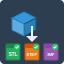

# Multi-Format Export - FreeCAD Macro



**Version:** 0.5.0-beta
**FreeCAD Version:** 0.19 or later
**License:** MIT

> **Documentation:** [https://spkane.github.io/freecad-robust-mcp-and-more/](https://spkane.github.io/freecad-robust-mcp-and-more/)

## Overview

This FreeCAD macro exports selected objects to multiple file formats simultaneously with a single click. It features a user-friendly dialog for selecting export formats, configuring output options, and previewing the files that will be created.

Perfect for:

- Preparing files for 3D printing (STL, 3MF)
- CAD interchange with colleagues or clients (STEP, IGES)
- Asset creation for games or visualization (OBJ, PLY)
- Backup exports in multiple formats

## Features

- **Multi-Format Export** - Export to up to 8 different formats at once
- **Smart Defaults** - STL, STEP, and 3MF selected by default (most common formats)
- **Intelligent Path Defaults** - Uses document location and object names automatically
- **Mesh Quality Control** - Adjustable tolerance and deflection for mesh formats
- **Preview Mode** - See exactly what files will be created before exporting
- **Progress Feedback** - Real-time progress bar and status messages
- **Batch Export** - Export multiple selected objects together

---

## Supported Formats

| Format | Extension | Default | Description                              |
| ------ | --------- | ------- | ---------------------------------------- |
| STL    | `.stl`    | Yes     | Stereolithography - standard 3D printing |
| STEP   | `.step`   | Yes     | CAD interchange - preserves geometry     |
| 3MF    | `.3mf`    | Yes     | Modern 3D printing with metadata         |
| OBJ    | `.obj`    | No      | Wavefront - 3D graphics and games        |
| IGES   | `.iges`   | No      | Legacy CAD interchange                   |
| BREP   | `.brep`   | No      | OpenCASCADE native - exact geometry      |
| PLY    | `.ply`    | No      | Polygon file - 3D scanning               |
| AMF    | `.amf`    | No      | Additive manufacturing format            |

---

## Installation

### macOS

1. Open **Finder**
1. Press `Cmd + Shift + G` (Go to Folder)
1. Paste: `~/Library/Application Support/FreeCAD/Macro/`
1. Press **Enter**
1. Copy `MultiExport.FCMacro` to this folder
1. (Optional) Copy `MultiExport.svg` for the icon

**From FreeCAD:**

1. Go to **Macro → Macros...**
1. Note the path shown at the top of the dialog
1. Click **User macros location** to open in Finder
1. Copy files there

### Linux

```bash
mkdir -p ~/.FreeCAD/Macro/
cp MultiExport.FCMacro ~/.FreeCAD/Macro/
cp MultiExport.svg ~/.FreeCAD/Macro/  # Optional icon
```

### Windows

1. Navigate to: `%APPDATA%\FreeCAD\Macro\`
1. Copy `MultiExport.FCMacro` to this folder
1. (Optional) Copy `MultiExport.svg` to the same folder

---

## How to Use

### Quick Start

1. **Select objects** in the 3D view (Ctrl+click for multiple)
1. **Run the macro:** Macro → Macros... → MultiExport → Execute
1. **Choose formats** (STL, STEP, 3MF are pre-selected)
1. **Set output location** and filename
1. **Click Export**

### Detailed Steps

#### Step 1: Select Objects

- Click on one or more objects in the 3D view
- Hold `Ctrl` (or `Cmd` on macOS) to select multiple objects
- Selected objects appear in the "Objects to Export" list

#### Step 2: Choose Export Formats

The dialog shows all available formats with checkboxes:

- **STL** - Checked by default (3D printing standard)
- **STEP** - Checked by default (CAD interchange)
- **3MF** - Checked by default (modern 3D printing)

Quick selection buttons:

- **Select All** - Check all formats
- **Select None** - Uncheck all formats
- **Reset Defaults** - Return to STL + STEP + 3MF

#### Step 3: Configure Output

**Directory:**

- Defaults to the same folder as the current FreeCAD document
- Click **Browse...** to choose a different location

**Base Filename:**

- Defaults to the selected object's label (single object)
- Or the document name (multiple objects)
- Enter any name (without extension)
- Extensions are added automatically based on selected formats

**Preview:**

- Shows the files that will be created
- Updates in real-time as you change options

#### Step 4: Mesh Options (Optional)

For mesh formats (STL, OBJ, PLY, 3MF, AMF):

**Surface Tolerance:**

- Lower values = finer mesh = larger files
- Default: 0.1mm (good balance)
- For fine details: 0.01-0.05mm
- For quick exports: 0.2-0.5mm

**Angular Deflection:**

- Controls curved surface approximation
- Default: 0.1mm
- Lower values = smoother curves

#### Step 5: Export

- Click **Export**
- Watch the progress bar
- Review results in the status area

---

## Parameter Reference

### Output Configuration

| Parameter     | Default           | Description                  |
| ------------- | ----------------- | ---------------------------- |
| Directory     | Document location | Where to save exported files |
| Base Filename | Object/Doc label  | Filename without extension   |

### Mesh Settings

| Parameter          | Default | Range      | Description                   |
| ------------------ | ------- | ---------- | ----------------------------- |
| Surface Tolerance  | 0.1 mm  | 0.001-10mm | Mesh fineness (lower = finer) |
| Angular Deflection | 0.1 mm  | 0.001-10mm | Curved surface approximation  |

---

## Use Cases

### Case 1: 3D Printing Preparation

**Scenario:** Export a model for printing on different slicers

**Settings:**

- Formats: STL + 3MF
- Tolerance: 0.1mm (standard quality)

**Result:** Files ready for Cura, PrusaSlicer, Bambu Studio, etc.

### Case 2: Sharing with CAD Users

**Scenario:** Send design to colleague using SolidWorks

**Settings:**

- Formats: STEP + IGES
- (Mesh settings don't apply to these formats)

**Result:** Editable CAD files that preserve exact geometry

### Case 3: Game Asset Export

**Scenario:** Create 3D model for Unity/Unreal

**Settings:**

- Formats: OBJ + PLY
- Tolerance: 0.05mm (good detail)

**Result:** Standard mesh formats for game engines

### Case 4: Complete Backup

**Scenario:** Archive a project in all formats

**Settings:**

- Click **Select All** for all formats
- Directory: Your backup location

**Result:** Complete export in 8 formats for future compatibility

---

## Troubleshooting

### Error: "No Selection"

**Solution:** Select one or more objects in the 3D view before running the macro.

### Error: "No Exportable Objects"

**Cause:** Selected items are not solid objects (groups, annotations, etc.)

**Solution:** Select actual Part or PartDesign bodies with solid geometry.

### Error: "Invalid Directory"

**Solution:** The chosen directory doesn't exist. Click Browse and select a valid folder.

### Warning: Format export failed

**Possible causes:**

1. **Object has invalid geometry** - Try Part → Check Geometry first
1. **Disk full** - Check available disk space
1. **Permission denied** - Choose a folder you have write access to

---

## Technical Details

### Export Methods

| Format | Export Method                    |
| ------ | -------------------------------- |
| STL    | Mesh tessellation → Mesh.write() |
| STEP   | Part.Shape.exportStep()          |
| 3MF    | Mesh tessellation → Mesh.write() |
| OBJ    | Mesh tessellation → Mesh.write() |
| IGES   | Part.Shape.exportIges()          |
| BREP   | Part.Shape.exportBrep()          |
| PLY    | Mesh tessellation → Mesh.write() |
| AMF    | Mesh tessellation → Mesh.write() |

### Multiple Objects

When multiple objects are selected:

- **Mesh formats:** Objects are combined into a single compound mesh
- **CAD formats:** Objects are combined into a Part.Compound

---

## Version History

### v0.5.0-beta (2026-01-05)

- Initial release
- 8 export format support (STL, STEP, 3MF, OBJ, IGES, BREP, PLY, AMF)
- Smart defaults (STL, STEP, 3MF pre-selected)
- Intelligent path and filename defaults
- Configurable mesh quality settings
- Real-time file preview
- Progress bar and status feedback
- Multi-object batch export

---

## License

MIT License - Free to use, modify, and distribute.

---

## Credits

Created to simplify the FreeCAD export workflow and eliminate repetitive export operations.
